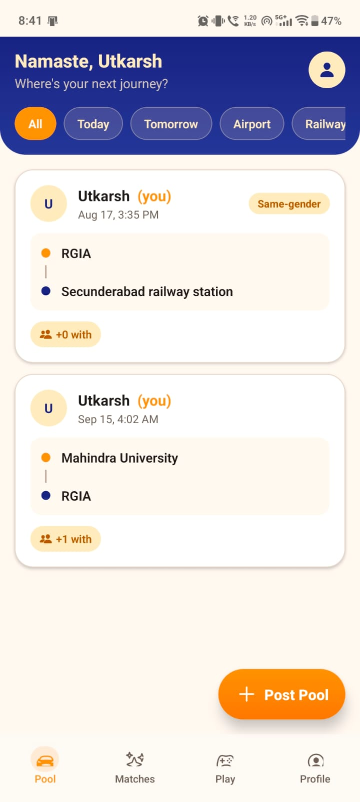
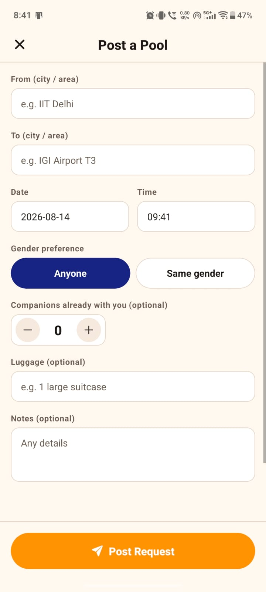
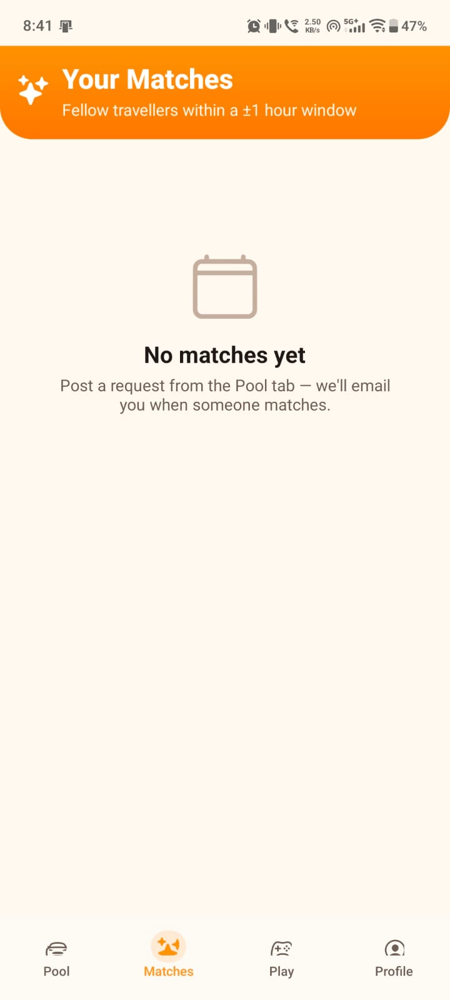
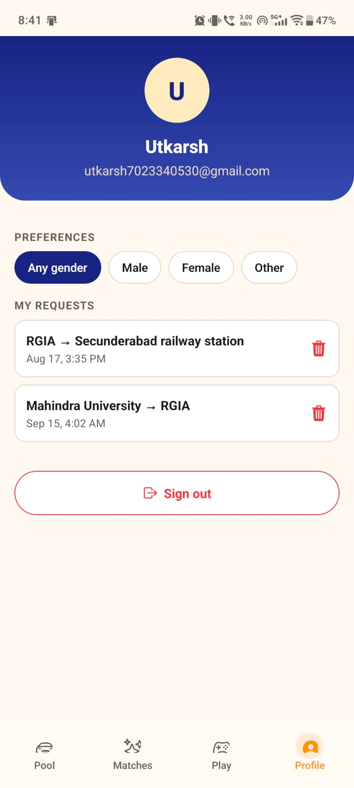
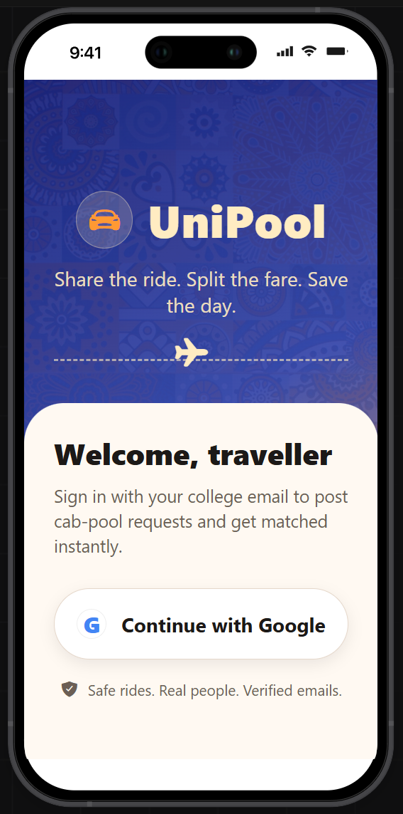

# 🚗 UniPool

> **A campus-focused carpooling platform that helps students discover, request, coordinate, and travel together.**

UniPool turns the usual **"anyone going to the airport?"** message buried in a university WhatsApp group into a structured travel network.

🌐 **[Open UniPool](https://uni-pool-ruddy.vercel.app)**

---

## 📱 What is UniPool?

UniPool is designed around a simple problem: students frequently travel between universities, railway stations, airports, hostels, homes, and other common destinations, but finding someone on the same route is usually fragmented across chats and personal contacts.

The app gives students one place to:

- create a travel plan
- discover other students travelling similar routes
- search and filter available pools
- request to join someone else's ride
- accept or decline incoming requests
- see confirmed travellers
- communicate with other travellers
- manage their profile and preferences
- rate people after travelling together
- report or block users when necessary

The goal is not just to **find a ride**, but to make the whole coordination process structured and easier to manage.

---

## ✨ Core Experience

```text
Create a travel plan
        ↓
Discover compatible pools
        ↓
Review route, time & traveller details
        ↓
Request to join
        ↓
Pool owner accepts / declines
        ↓
Confirmed travellers connect
        ↓
Coordinate the journey
        ↓
Rate each other after the trip
```

---

## 🧭 Main Features

### 🗺️ Discover & Search

The home feed acts as the central marketplace for travel plans.

- Browse active travel pools
- Search by route or traveller name
- Filter by **Today, Tomorrow, This week, Airport, Railway** and more
- Switch between list and map views
- Pull to refresh the latest pools
- Open a pool to view its complete details

### 🚗 Create a Pool

Students can publish their own journey with information such as:

- starting location
- destination
- travel date and time
- number of companions
- luggage requirements
- gender preference
- additional notes

Pools can subsequently be updated, closed, reopened, or deleted by their owner.

### 🤝 Request-to-Join System

Instead of immediately exposing everyone to everyone, UniPool uses a request workflow:

1. A traveller finds a suitable pool.
2. They send a **Request to join**.
3. The pool owner receives the request.
4. The owner can **accept or decline** it.
5. Accepted travellers become confirmed members of the journey.

This gives the person organising the ride control over who joins.

### ⚡ Route & Time Matching

UniPool can identify compatible travel plans using:

- matching origin
- matching destination
- travel times within a **±1-hour window**
- different users
- compatible gender preferences

This makes it possible to surface potential travel companions without requiring students to manually search through multiple groups.

### 💬 Messaging & Presence

Once travellers are connected, the app supports direct communication through:

- one-to-one conversations
- conversation history
- typing indicators
- online/presence information
- pool-specific context when starting a conversation

### ⭐ Trust & Reputation

UniPool includes lightweight reputation features to make repeat interactions more trustworthy:

- user ratings
- rating counts and averages
- profile badges
- post-trip ratings
- eligibility checks before rating another user

### 🛡️ Safety & Moderation

The platform includes user-level safety controls:

- report a user
- block/unblock users
- manage blocked users
- report a specific pool interaction

### 🎓 College Identity Verification

Users can verify their college identity using a college email verification flow, helping establish a more trusted university community.

### 🔔 Notifications

UniPool supports notification infrastructure for important activity such as requests and confirmed travel interactions, including web push subscription support.

### 👤 Account & Profile

Users can authenticate through:

- email and password
- Google sign-in

They can then manage their profile, preferences, and account session from within the app.

---

## 📸 Screenshots

### Home — Discover Travel Pools

<p align="center">
  
</p>

### Create a Pool

<p align="center">
  
</p>

### Matches

<p align="center">
  
</p>

### Profile

<p align="center">
  
</p>

---

## 🖼️ Product Overview

<p align="center">
  
</p>

---

## 🧠 Matching Model

The matching system is built around practical travel compatibility rather than generic social discovery.

For a new travel request, UniPool considers:

| Signal | Purpose |
|---|---|
| Origin | Find travellers leaving from the same area |
| Destination | Find travellers heading to the same destination |
| Travel time | Allow a practical ±1-hour matching window |
| Gender preference | Respect the traveler's selected preference |
| User identity | Prevent matching a user with their own request |

The resulting matches can then be surfaced to users and used to trigger relevant notifications.

---

## 🏗️ How It Works

```text
┌───────────────────────────────┐
│       UniPool Client          │
│   Expo / React Native / Web   │
│          TypeScript           │
└───────────────┬───────────────┘
                │
             REST / JSON
                │
                ▼
┌───────────────────────────────┐
│          FastAPI API          │
│             Python            │
├───────────────────────────────┤
│ Auth · Pools · Requests       │
│ Matches · Messages · Ratings  │
│ Profiles · Reports · Push     │
└───────────┬─────────┬─────────┘
            │         │
            ▼         ▼
      ┌──────────┐  ┌──────────────┐
      │ MongoDB  │  │ Notification │
      │          │  │ / Email APIs │
      └──────────┘  └──────────────┘
```

The frontend is built with Expo/React Native and TypeScript, while the backend exposes a FastAPI REST API backed by MongoDB. The deployed web experience is hosted through Vercel.

---

## 🧩 Application Areas

| Area | Functionality |
|---|---|
| **Authentication** | Email/password and Google sign-in |
| **Home Feed** | Browse, search and filter travel pools |
| **Pool Creation** | Publish and manage journeys |
| **Matching** | Route + time based compatibility |
| **Requests** | Request, accept, decline and cancel |
| **Confirmed Trips** | Track travellers who are joining |
| **Messaging** | Direct conversations and typing/presence |
| **Profiles** | User information, preferences and badges |
| **Ratings** | Post-trip reputation system |
| **Safety** | Reports and blocking |
| **Verification** | College email verification |
| **Notifications** | Push notification subscription support |
| **Admin** | Platform statistics and pool moderation |

---

## 🛠️ Technology

**Frontend**

`React Native` · `Expo` · `TypeScript` · `Expo Router`

**Backend**

`Python` · `FastAPI` · `Pydantic`

**Data & Services**

`MongoDB` · `REST API` · `Google Authentication` · `Web Push` · `Email`

**Deployment**

`Vercel`

---

## 📂 Project Structure

```text
UniPool/
├── app/
│   ├── frontend/          # Expo / React Native application
│   │   ├── app/            # Application routes and screens
│   │   └── src/            # API, auth, components and UI logic
│   │
│   └── backend/            # FastAPI application
│
├── assets/                 # README screenshots and project artwork
└── README.md
```

---

## 🌐 Deployment

UniPool is deployed as a live web application and connected to the GitHub repository for the project.

**Live application:** https://uni-pool-ruddy.vercel.app

---

## 🎯 Project Goal

UniPool is built as a practical campus mobility product: a focused system for turning fragmented student travel coordination into a searchable, request-based, and reputation-aware network.

Rather than treating carpooling as just a ride listing, the product covers the complete interaction loop — **discovery → matching → requests → confirmation → communication → travel → reputation**.

---

<p align="center">
  <strong>UniPool — Find your route. Find your people. Share the journey. 🚗</strong>
</p>
